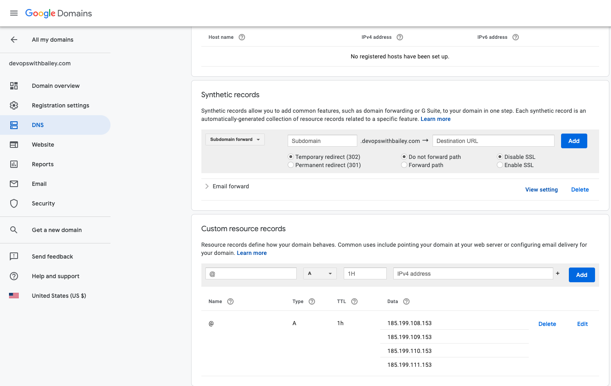
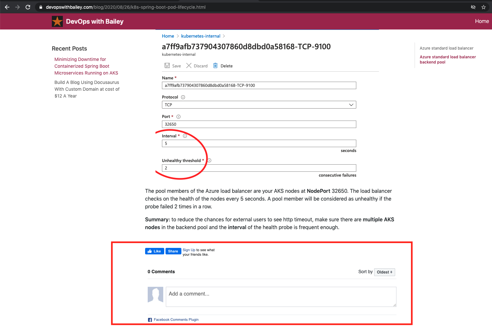

# Building A Blog Using Docusaurus With Custom Domain at cost of $12 A Year
Publishing your blog website at GitHub Pages for free. The only cost($12 per year) is for custom domain if you do not want to use GitHub Pages domain.

## Installing Docusaurus
Please refer to https://docusaurus.io/docs/en/installation

## Running Docusaurus in Blog Only mode
Please refer to https://docusaurus.io/docs/en/adding-blog#i-want-to-run-in-blog-only-mode

Also, you can refer to [index.html](website/static/index.html)

## Publishing Your Site Using GitHub Pages
Please refer to https://docusaurus.io/docs/en/publishing#using-github-pages
### Custom Domain
1. [Server Side Config](website/siteConfig.js)
    ```
    url: 'https://devopswithbailey.com', // Your website URL
    baseUrl: '/', // Base URL for your project */
    // For github.io type URLs, you would set the url and baseUrl like:
    //   url: 'https://facebook.github.io',
    //   baseUrl: '/test-site/',
    ```
    **Note:** For custom domain type URLs, you would set baseUrl to '/' instead of your project path, or else it would not find the correct path for css and js. 
2. Domain Config
    
    Add A records for your DNS, which pints your domain to GitHub Pages IP addresses.
      
### CICD Using Travis CI
Please refer to https://docusaurus.io/docs/en/publishing#using-travis-ci

## Enabling FacebookComments 
```
siteConfig.js

facebookAppId: '931278130705150',
facebookComments: true,
```
1. facebookAppId [string]
    If you want Facebook Like/Share buttons in the footer and at the bottom of your blog posts, provide a [Facebook application id](https://developers.facebook.com/docs/apps/#register).

2. facebookComments [boolean]
    Set this to true if you want to enable Facebook comments at the bottom of your blog post. facebookAppId has to be also set.


## Track page views
```
siteConfig.js

gaTrackingId: 'UA-176081093-1', 
// Google Analytics tracking ID to track page views.
// Sign up Google Analytics at https://marketingplatform.google.com/about/analytics/
```
